# Summary of GO for JS Dev
Summary of GO for Javascript Developer by Brenna Martenson. The objectives of this course is to learn the syntax of Go, what data structures are available to you, and how to handle errors responsibly. After getting an idea of what you have to work with, you’ll create a web server with routing, build an application to hit an external API, and receive a brief introduction on how the Go language manages concurrency with goroutines!

# Introduction
Go is a statically typed, compiled programming language designed at Google by Robert Griesemer, Rob Pike, and Ken Thompson. Go is syntactically similar to C, but with memory safety, garbage collection, structural typing, and CSP-style concurrency.

GO advantages :
- Fast complie times
- Ease of development (lots in common and reduces compleity of C language)
- Fast build time

### Installing GO
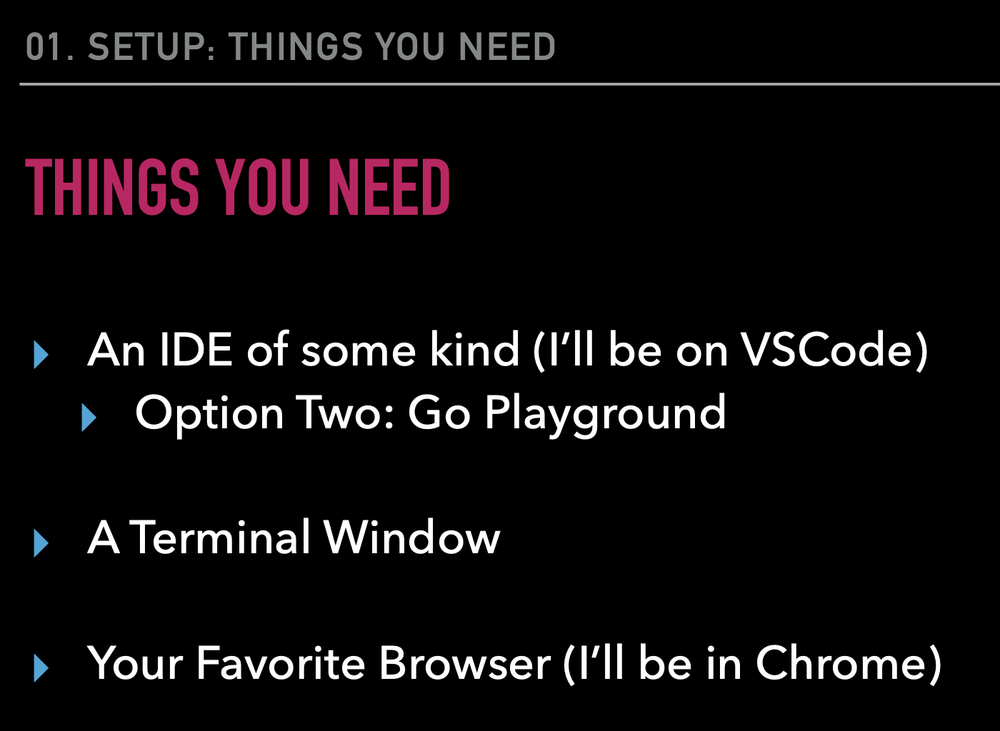
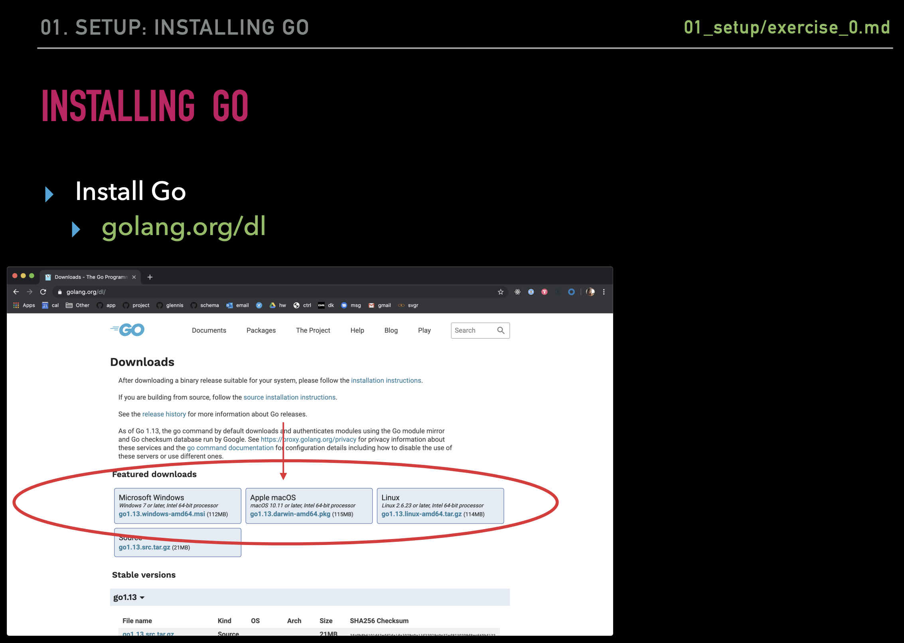
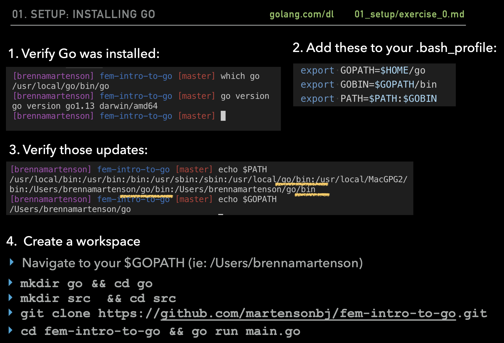

### GO vs JavaScript Comparison
| Type | GO | JS |
| ------------- | ------------- | ------------- |
| Typing | Strongly typed (String, Float, Int, Byte, Struct) | Dynamically typed (Variables can change ) |
| Structures | Structs, Pointers, Methods, Interfaces | ES6 Classes |
| Error Handling | Explicit | Built in |
| Multi Tasking | Multi-Threaded (Concurrency, Goroutines, Sync) | Single-Threaded (Callbacks, async await, sagas, sadness) |
| Opiniated-ness | Strong Opinions (Convention, built in tooling and linters) | Fluid Opinions (Subjective to the mood that day) |

### Anatomy of GO file
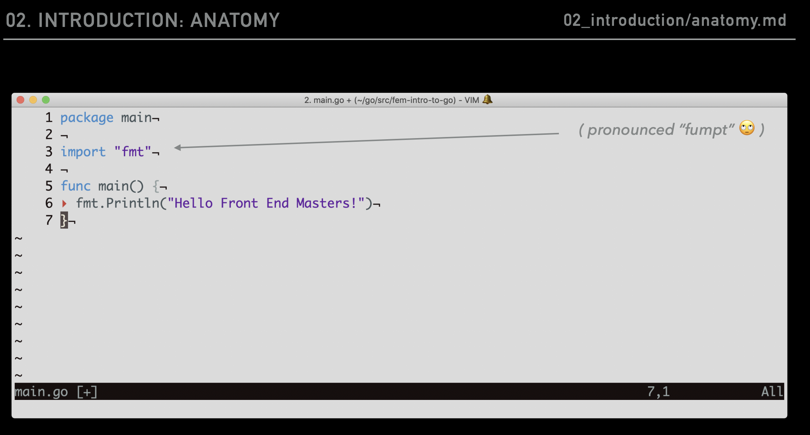

# Printing
### Printing with `fmt`
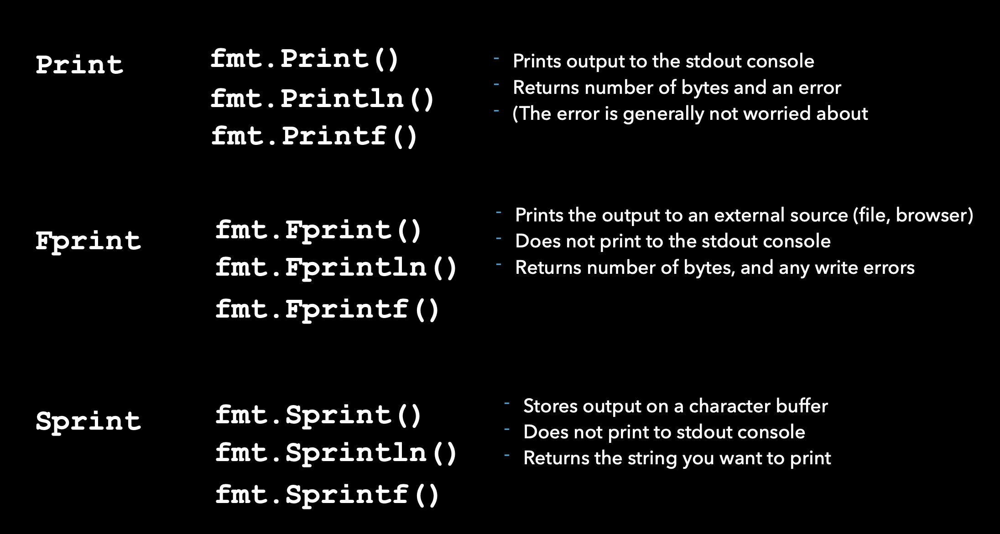

# Basic GO Syntax
### Types
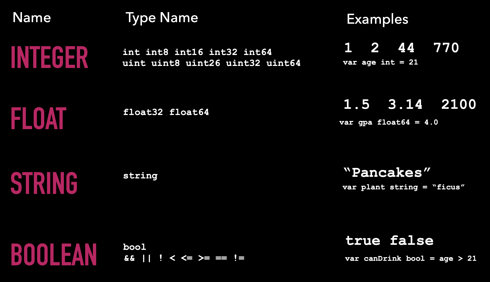

### Variables
A variable is a piece of storage containing data temporarily to work with it. The most general form to declare a variable in Golang uses the var keyword, an explicit type, and an assignment.

> var name type = expression

### Control Structures - IF & ELSE
```
var someVar = 9

if someVar > 100 {
  fmt.Println("greater than 100")
} else if someVar  == 100 {
  fmt.Println("equals 100")
} else {
  fmt.Println("less than 100")
}
```

### Control Structures - Switch Statements
```
var city string

switch city{
case "Des Moines":
     fmt.Println("you live in iowa")
case "Minneapolis,","St Paul":
     fmt.Println("you live in minnesota")
case "Madison":
     fmt.Println("you live in wisconsin")
default:
     fmt.Println("you are not from around here")
}
```

### Control Structures - For Loops
```
for i := 1; i <= 100; i++ {
  fmt.Println(i)
} 

var mySentence = "this is sentence"

for index, letter := range mySentence{
  fmt.Println("Index:", index, "Letter:", string(letter))
}
```

# Complex Structures
### Functions & Variadic Functions
A function is a group of statements that exist within a program for the purpose of performing a specific task. At a high level, a function takes an input and returns an output. Function allows you to extract commonly used block of code into a single component.
```
func printAge(age int) int {
  fmt.Println(age)
  return age
}
```

### Arrays
| GO | JS |
| ------------- | ------------- |
| 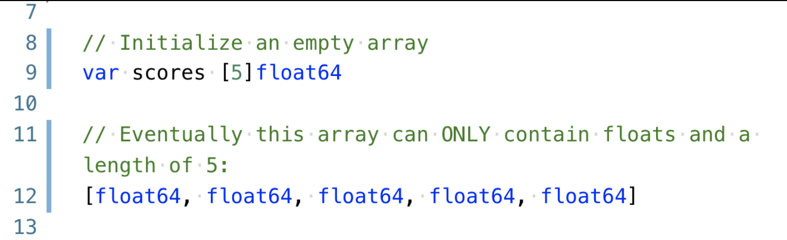 | 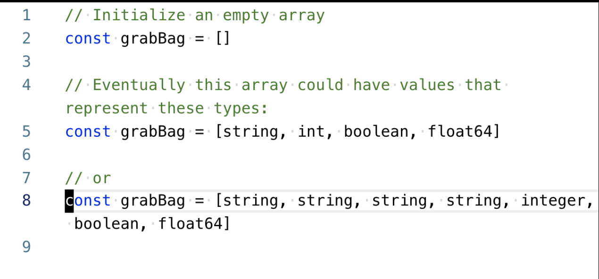 |

### Make
`make` is a built-in slice function used to create a slice. The `make` function takes three arguments: type, length, and capacity, and returns the slice. To create dynamically sized arrays, use the `make` function. The `make` function allocates a zeroed array and returns a slice that refers to that array.

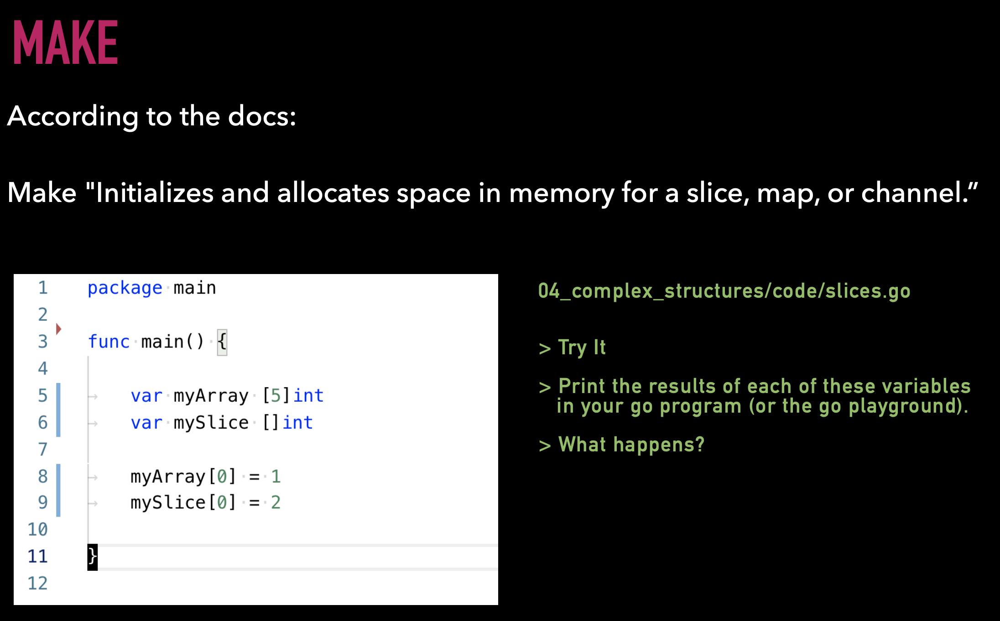

### Slices
`Slices` are a key data type in Go, giving a more powerful interface to sequences than arrays. Unlike arrays, `slices` are typed only by the elements they contain (not the number of elements). To create an empty slice with non-zero length, use the builtin make. Here we make a slice of strings of length 3 (initially zero-valued).

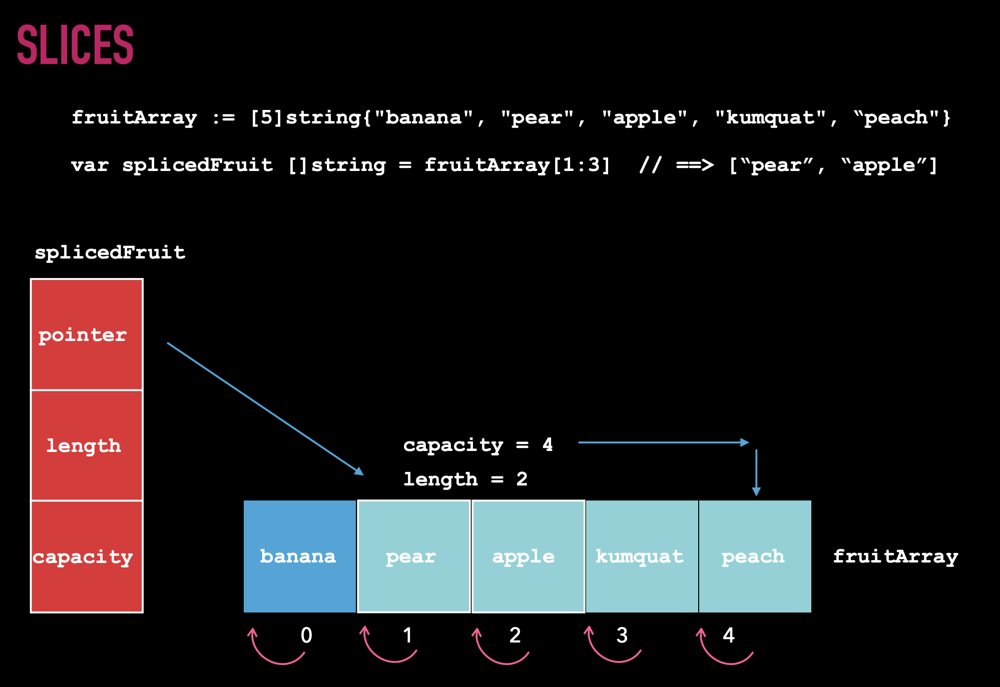

### Maps
`Maps` is a collection of unordered pairs of key-value. It is widely used because it provides fast lookups and values that can retrieve, update or delete with the help of keys. It is a reference to a hash table.

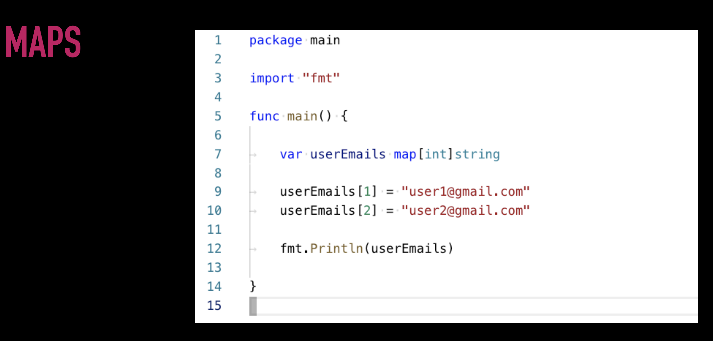

# GO Toolkit
### Tools & Commands
- go run main.go (compile and run Go program)
- go build (compile the packages and dependencies that you have defined/used in your project)
- go install (go build just compiles the executable file and moves it to the destination. go install does a little bit more. It moves the executable file to $GOPATH/bin and caches all non-main packages which are imported to $GOPATH/pkg)
- go fmt main.go (format numbers and strings padded with spaces or zeroes, in different bases, and with optional quotes)
- go list (can give you some listing info for the packages matched this way (you may be interested in its -f flag))
- go vet (examines Go source code and reports suspicious constructs, such as Printf calls whose arguments do not align with the format string.)
- go doc fmt.Println (extracts and generates documentation for Go programs)
- go get golang.org/x/lint/golint (implementing packages)
- golint (a linter maintained by the Go developers.)

### Packages
In the most basic terms, A package is nothing but a directory inside your Go workspace containing one or more Go source files, or other Go packages. Every Go source file belongs to a package.


### Unit Testing

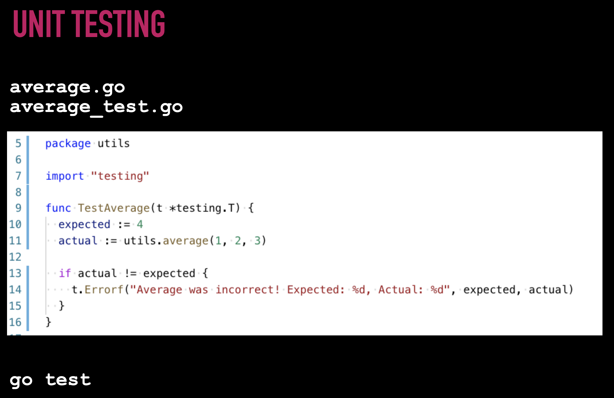

# Structs
A structure or struct in Golang is a user-defined type that allows to group/combine items of possibly different types into a single type. Any real-world entity which has some set of properties/fields can be represented as a struct.

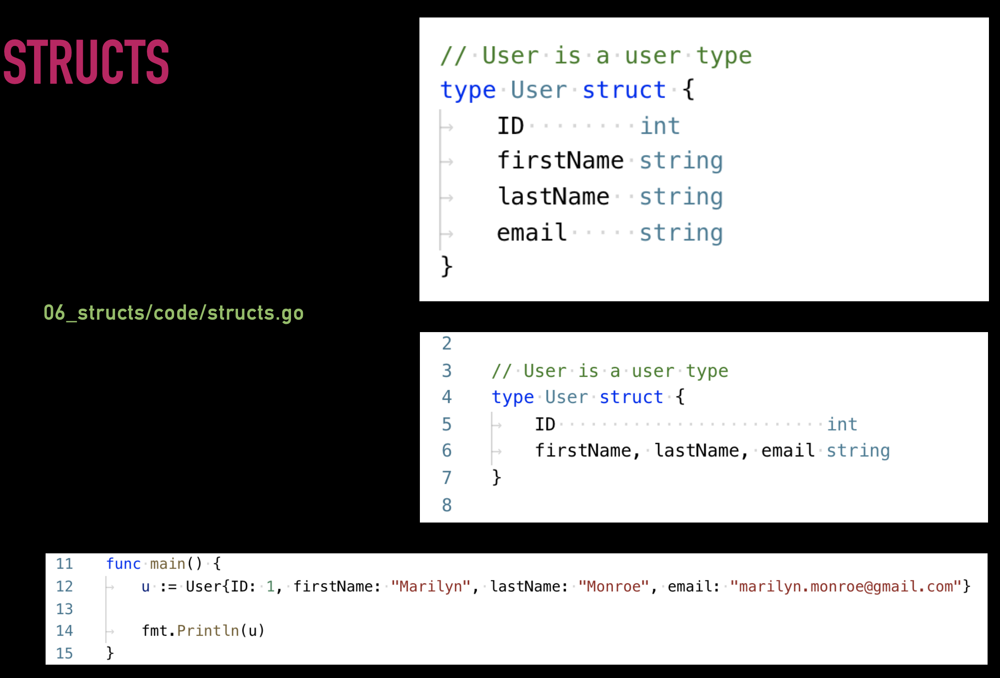

### Custom Types
```
// User is a user type
type User struct {
  ID int
  Fistname, Lastname, Email string
}

// Group represent a set of user
type Group struct {
  role string
  users []User
  newestUser User
  spaceAvailable bool
}
```

# Pointers
A pointer in Go is a variable that holds the memory location of that variable instead of a copy of its value.

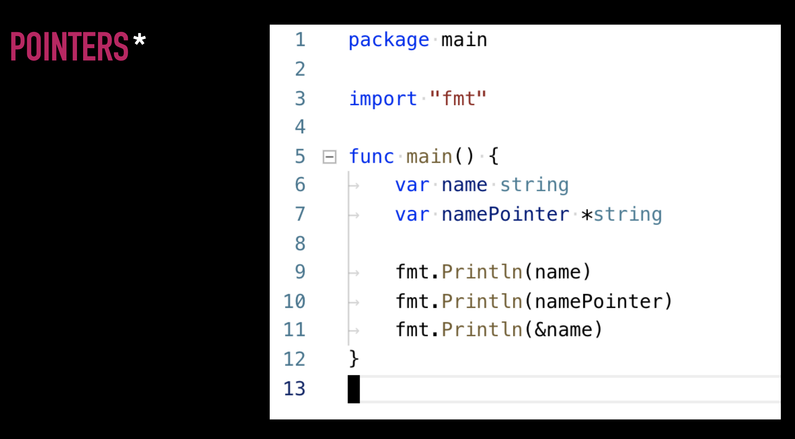
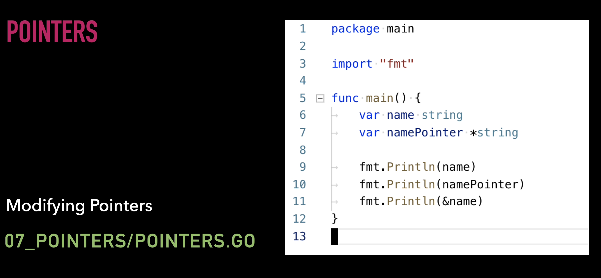

summary :
- Pointer type definitions are indicated with a `*` next to the type name. Indicate that the variable will point to a memory location. ex : `var namePointer *string`
- Pointer variable values are visible with a `*` next to the variable name. ex : `var nameValue = *namePointer`
- To read through a variable to see the pointer address use a `&` next to the pointer variable name. ex : `var nameAddress = &namePointer`

# Error Handling
ERROR :
- indicates that something bad happened, but it might be possible to continue running the program. 
- ie: A function that intentionally returns an error if something goes wrong.

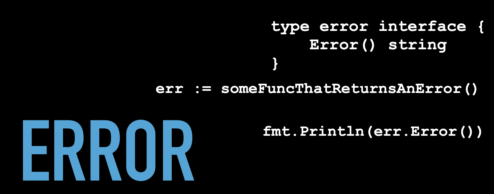

PANIC :
- happens at run time
- something happened that was fatal to your program and program stops execution.
- ex: Trying to open a file that doesn’t exist.

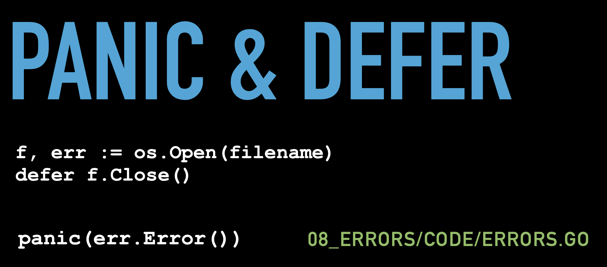

RECOVER :
- Recover tells Go what to do when that happens. 
- Returns what was passed to panic. 
- Recover must be paired with defer, which will fire even after a panic.

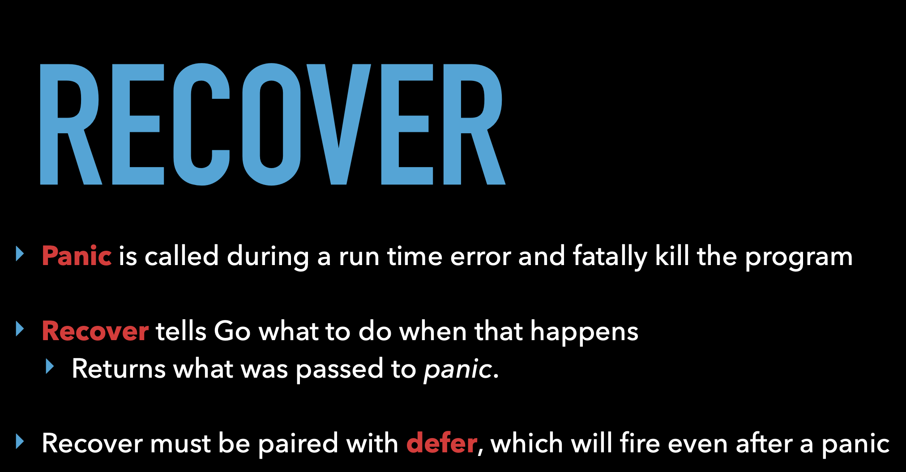

# Methods
Go does not have classes. However, you can define methods on types. A method is a function with a special receiver argument. The receiver appears in its own argument list between the func keyword and the method name.

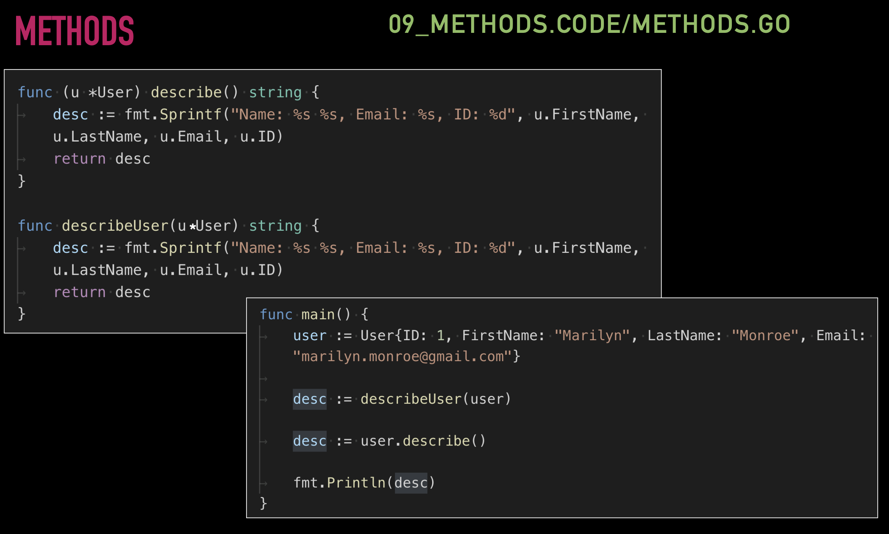

# Interfaces
An interface type is defined as a set of method signatures. A value of interface type can hold any value that implements those methods.

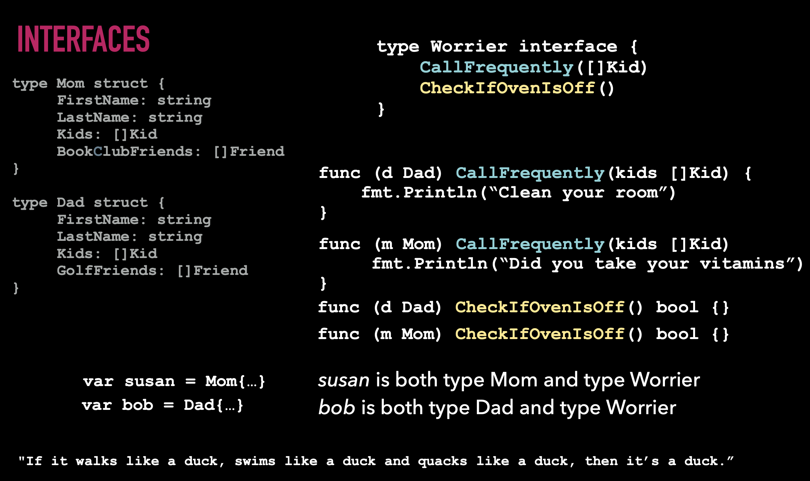


### Empty Interfaces
The interface type that specifies zero methods is known as the empty interface: `interface{}`. An empty interface may hold values of any type. (Every type implements at least zero methods.)

Empty interfaces are used by code that handles values of unknown type. For example, `fmt.Print` takes any number of arguments of type `interface{}`.
